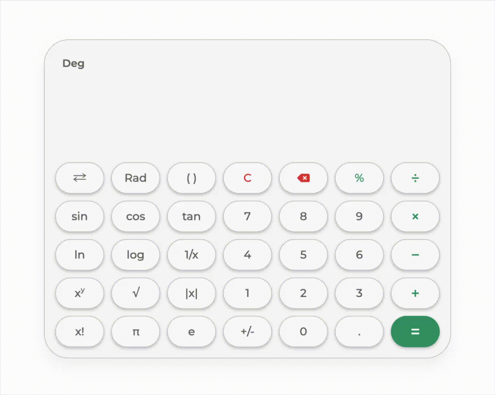

<a name="top"></a>
# Scientific Calculator with Vanilla TypeScript
This is a zero-dependency, fully responsive scientific calculator built from scratch using TypeScript, HTML, and CSS. Instead of relying on methods like `eval()`, this project features a custom-built mathematical engine comprised of a Lexical Scanner, a Shunting Yard Parser, and a Stack-Machine Evaluator.

## Table of Contents
- [Demo](#demo)
- [Features](#features)
- [Setup](#setup)
- [How to Use](#how-to-use)
- [Code Structure](#code-structure)
- [License](#license)

## Demo


## Features
- **Custom Math Engine:** Safely parses and evaluates complex expressions (e.g., `5 + 4 × sin(3 + 6) - 1`) using Reverse Polish Notation (RPN).
- **Advanced Operations:** Supports all major trigonometric functions, logarithms, factorials (!), permutations (nPr), combinations (nCr), and modulo operations.
- **Different Angle Units:** Supports the three major angle measuring units (degree, radian, and gradian).
- **Continuous Calculation:** Intelligently chains operations by appending or wrapping the previous result when a new operator or function is clicked.
- **Dynamic Formatting:** Automatically applies thousands separators (e.g., `1,234,567.89`) to both the active input and the final result to ensure readability.
- **Fluid & Responsive Design:** Utilizes CSS `clamp()` and media queries to seamlessly transition from a floating desktop widget to a full-screen, fluid mobile interface.

## Setup
To run this project, you will need Node.js installed to compile the TypeScript file into JavaScript.

1. Clone the repository and navigate into the project directory.
2. In the project root directory run the following:
```bash
npx tsc
```
3. Once the `script.js` file is generated in the `dist` folder, simply open `index.html` in any  web browser to use the calculator.

## How to Use
When you open the calculator, you will see a standard scientific keypad.
- **Basic Math:** Click numbers and basic operators to form an expression.
- **Advanced Math:** Click the `⇄` button to toggle the secondary keyboard layer, revealing hyperbolic trigonometric functions and inverse operations.
- **Angle Modes:** Click the `Deg` / `Rad` / `Grad` button to cycle through angle modes for trigonometric calculations.
- **Chaining:** After pressing `=`, you can immediately click an operator (like `+`) to continue adding to your result, or click a function (like `sin`) to wrap your result.
- **Editing:** Use the backspace button to intelligently remove single characters or entire multi-character function blocks (e.g., `sinh(`).

## Code Structure
### File Organization
- `index.html`: Defines the semantic structure of the calculator. It uses a flat button hierarchy within a `keyboard` grid to allow for easy CSS Grid manipulation.
- `style.css`: Includes all the styling, and manages the "Fluid Design." It utilizes CSS `clamp()` for font sizes and button dimensions, ensuring the UI remains usable on various screen sizes.
- `src/script.ts`: The "brain" of the application. It contains the logic for state management, UI event listeners, and the core mathematical engine.

Once compilation is complete, a `dist` folder containing the compiled JavaScript and source maps is generated.

### How the Engine Works

The calculator operates on a three-stage pipeline to transform a raw string of characters into a precise numerical result.

#### 1. The Lexical Scanner (`tokenize`)
Before any math occurs, the raw string is scanned to identify "Tokens". The scanner iterates through the input and categorizes chunks into a `Token` interface:

```typescript
interface Token {
    type: 'Number' | 'BinaryOperator' | 'PrefixUnary' | 'PostfixUnary' | 'Constant' | ... ;
    value: string;
}
```

- **Multi-character Detection**: The engine identifies functions like `asinh(` or `mod` by checking for specific character buffers at the end of the string using a dedicated regex.
- **Contextual Intelligence**: It distinguishes between a **Binary Minus** ($5 - 3$) and a **Unary Minus** ($-5$) by checking if the preceding token is an operator or a parenthesis.
- **Automatic Multiplication**: The scanner and click-handlers work together to inject implicit multiplication, turning $5\pi$ or $2(3)$ into $5 \times \pi$ and $2 \times (3)$.

#### 2. The Shunting Yard Parser (`parse`)
Mathematical expressions are naturally written in **Infix Notation** ($A + B$), which is difficult for computers to evaluate due to operator precedence and nested parentheses. The engine implements **Dijkstra’s Shunting Yard Algorithm** to convert the expression into **Postfix Notation** (Reverse Polish Notation).

- **Precedence & Associativity**: The engine consults a internal map (`PRECEDENCE`) to decide which operators "win." For example, $\times$ has higher precedence than $+$, and exponentiation (^) is marked as right-associative.
- **The Stack & Queue**: Operators are temporarily held on a stack, while operands are pushed to a postfix queue. Meeting a closing parenthesis triggers a stack "pop" until the expression is flattened into a linear, parenthesis-free sequence.

#### 3. The Stack-Machine Evaluator (`evaluate`)
The final stage processes the RPN queue using a classic Stack Machine:
- **Operands**: Numbers or constants (like $\pi$ or $e$) are pushed onto the stack.
- **Unary Operators**: Functions like $\sin$ or $!$ pop one value, apply the logic (including angle conversion for degrees, radians, or gradians), and push the result back.
- **Binary Operators**: Operators like $+$, $nPr$, or $mod$ pop two values, calculate the result, and push it back.

### UI & State Management
- **Chaining Calculations**: The `isCalculated` state allows the engine to either clear the screen for a new number or chain an operator (e.g., $Ans + ...$) to the previous result.
- **Precision Guarding**: To prevent floating-point errors (e.g., $0.1 + 0.2$), the engine utilizes `.toPrecision(15)` and `parseFloat` before final formatting.
- **Visual Formatting**: The `formatExpression` helper isolates visual formatting from backend logic, adding thousands-separators (commas) for readability without breaking the mathematical parser.

## License
This project is open source and available under the MIT License.
See the [LICENSE](LICENSE.md) file for more information.

##
[Back to Top](#top)